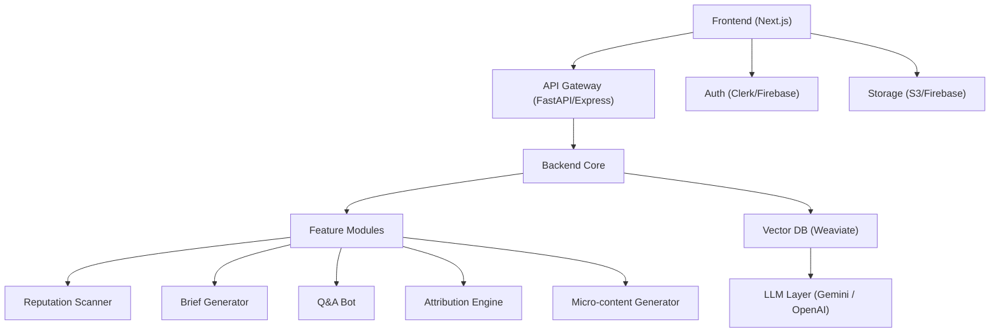

# 📰 Product PDR: AI-Powered Full-Stack PR Suite (MCP)

## 💡 Inspiration

Originally shared in [this LinkedIn post](https://www.linkedin.com/feed/update/urn:li:activity:7333001533128613910/), this project was born during my Digital PR course at **FLAME University, Pune**. I noticed how students and professionals alike were bogged down by repetitive, manual PR workflows.

That led to the concept of an AI-native **Media Communication Partner (MCP)**—a system designed to automate foundational PR work.

## 🌟 Our Goal

* Automate core PR tasks like sentiment audits, hook generation, and gap detection
* Accelerate learning with real-time, intelligent suggestions
* Build a unified, modular, and scalable PR productivity platform

This builds on previous reflections shared [here](https://www.linkedin.com/feed/update/urn:li:activity:7313205339410026497/).

## 🧱 What This Project Includes

* Media Sentiment & Reputation Auto-Audits
* Narrative Gap Detection with LLMs
* PR Brief & Hook Generator
* Message Stress Testing (Simulated Journalist Q\&A)
* Impact Attribution for Earned Media
* AI Micro-content Repurposing (Reels, Threads, Carousels)
* Thought Leadership & POV Generator
* AI Interview Coach
* Real-Time Crisis Detection

## 📋 Prompt Created in Course

## 🧩 Problem

PR tools today are fragmented. You juggle between media monitoring, content creation, and crisis alerts—all while battling disjointed analytics. There's no **end-to-end AI-powered platform** for PR pros.

## 🌈 Vision

We aim to build the **Notion x HubSpot for PR**: a modular, AI-powered suite that enables:

* Faster workflows
* Media-first strategies
* Real-time analysis
* Storytelling without losing the human touch

## 🔧 Core Feature Stack

### 1. **Media Reputation Auto-Audit**

* Scores brand sentiment across news, podcasts, YouTube
* Uses LLM + sentiment classifiers
* UI: Dashboard with trends and competitive benchmarks

### 2. **Narrative Gap Detection**

* Identifies content blind spots
* Uses vector embeddings + LLMs
* UI: Radar chart showing under/over-leveraged angles

### 3. **Brief Generator Bot**

* Creates story hooks, PR briefs in your brand tone
* UI: Prompt builder + exportable outputs

### 4. **Message Stress Testing**

* Simulates journalist interviews
* RAG from journalist tweets/articles
* UI: Pitch scorecards and mock Q\&A

### 5. **PR Impact Attribution**

* Connects media coverage to business KPIs
* GA4, CRM, Search Console integrations
* UI: Interactive conversion timeline

### 6. **AI Micro-Content Repurposer**

* Converts press releases to carousels, reels, threads
* Uses templates + tone modeling
* UI: Canva/Figma-ready export panel

### 7. **Thought Leadership Generator**

* Crafts founder POVs, quote cards
* Trend mining + narrative generation

### 8. **AI Interview Coach**

* Simulated press Q\&A for executives
* Persona-based training with feedback

### 9. **Smart FAQ (Media Widget)**

* RAG over product docs and press kits
* Embeddable SEO-friendly newsroom chatbot

### 10. **Real-Time Crisis Detector**

* Detects dark web sentiment spikes
* LLM anomaly detection + alert scoring

## 🪖 MVP Feature Prioritization

| Feature                | Priority     |
| ---------------------- | ------------ |
| Media Reputation Audit | ✅ Core       |
| Brief Generator        | ✅ Core       |
| Message Stress Testing | ✅ Core       |
| Impact Attribution     | ✅ Core       |
| Content Repurposing    | ✅ Core       |
| Smart FAQ Widget       | Nice-to-have |
| Interview Coach        | Nice-to-have |
| Crisis Detector        | V2 Roadmap   |

---

# 🤖 LangGraph Agent Orchestration

| Agent Name              | Description                                                  |
| ----------------------- | ------------------------------------------------------------ |
| Supervisor Agent        | Routes requests and manages workflow orchestration           |
| Reputation Scanner      | Performs sentiment analysis + NER on scraped media           |
| Narrative Gap Agent     | Finds story blind spots via content contrast embedding       |
| Brief Generator Agent   | Produces hooks and briefs in branded tone                    |
| Message Stress Agent    | Simulates journalist interviews and scores pitch responses   |
| Attribution Agent       | Connects coverage to conversions and KPIs                    |
| Content Repurpose Agent | Converts PR content into reels, carousels, social copy       |
| Thought Leader Agent    | Generates POV content, quotes, and trend-based founder posts |
| Interview Coach Agent   | Helps execs rehearse for press interviews                    |
| Smart FAQ Agent         | Builds embeddable, contextual PR chat widgets                |
| Crisis Detector Agent   | Monitors dark web and real-time sentiment anomalies          |

---

## 📏 Architecture Overview

## 🔌 Third-Party Integrations

| Purpose              | Tools                           |
| -------------------- | ------------------------------- |
| Auth & Roles         | Clerk.dev / Firebase Auth       |
| Cloud Storage        | AWS S3 / Firebase Storage       |
| LLM APIs             | OpenAI / Gemini / Claude        |
| Scraping             | Diffbot / NewsCatcher / SerpAPI |
| Attribution          | GA4, PostHog, Search Console    |
| Vectors & Embeddings | Weaviate, Pinecone, OpenAI Ada  |
| Design Export        | Canva API / Figma / Zapier      |

## 🪧 Developer Stack

| Layer      | Tech Stack                          |
| ---------- | ----------------------------------- |
| Frontend   | Next.js + Tailwind CSS              |
| Backend    | Node.js (Express) / FastAPI         |
| DB         | Supabase (Postgres) + Prisma        |
| Vector DB  | Weaviate (hybrid filter enabled)    |
| Deployment | Vercel (FE) + Render / Railway (BE) |
| Monitoring | Sentry + PostHog                    |

## ⏱️ Phased Rollout

| Phase | Objective                 | Modules                            |
| ----- | ------------------------- | ---------------------------------- |
| Alpha | Internal test build       | Brief builder, sentiment scan      |
| Beta  | Limited user rollout      | Add Q\&A stress test + attribution |
| V1    | Open PR agency onboarding | Content studio, media widgets      |
| V2    | Full-scale SaaS rollout   | Crisis detection + deep analytics  |

---

## 🚀 Go-To-Market Plan

**Positioning:**

> "Not your regular PR tool. Your AI co-pilot for building iconic reputations."

**Target Users:**

* PR Agencies
* Brand Managers
* Communication Teams
* Founders & Executives

**Growth Channels:**

* LinkedIn Thought Leadership
* Invite-Only Beta
* CRM + Newsroom Integrations

## 💼 License

MIT or commercial license (TBD based on monetization).
